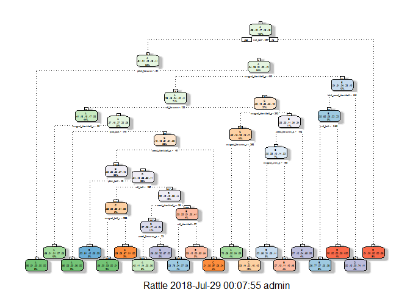

## Executive Summary
This study seeks to predict the manner in which the subjects did the exercise. Random forest model is found to have better prediction capability and hence used in favour of decision tree classification model.

## Getting and Cleaning Data

```r
# load required library
library(dplyr)
library(caret)
```

**DATA SOURCE**
Velloso, E.; Bulling, A.; Gellersen, H.; Ugulino, W.; Fuks, H. <a href="http://groupware.les.inf.puc-rio.br/work.jsf?p1=11201">Qualitative Activity Recognition of Weight Lifting Exercises</a>. Proceedings of 4th International Conference in Cooperation with SIGCHI (Augmented Human '13) . Stuttgart, Germany: ACM SIGCHI, 2013.

```r
# load training data
if(!file.exists("./pml-training.csv")){
  download.file("https://d396qusza40orc.cloudfront.net/predmachlearn/pml-training.csv",
                destfile = "./pml-training.csv")
}

train <- read.csv("./pml-training.csv", na.strings = c("NA", "#DIV/0!", ""))
dim(train)
```

```
## [1] 19622   160
```

```r
# remove columns containing more than 95% of NA values
nas95 <- sapply(train, function(x) (sum(is.na(x))/length(x) <= 0.95))
train <- train[nas95]
dim(train)
```

```
## [1] 19622    60
```


```r
# load test data
if(!file.exists("./pml-test.csv")){
  download.file("https://d396qusza40orc.cloudfront.net/predmachlearn/pml-testing.csv",
                destfile = "./pml-test.csv")
}

test <- read.csv("./pml-test.csv", na.strings = c("NA", "#DIV/0!", ""))
dim(test)
```

```
## [1]  20 160
```

```r
# clean test data by removing the same columns per train data
test <- test[nas95]
dim(test)
```

```
## [1] 20 60
```


## Cross Validation
To cross validate the model, the `TRAIN` dataset is divided into 70-30 proportion. The 70% subset will be used to train the model whereas the 30% subset will be used for cross validation.

```r
# split train data into 70-30 portions for cross validation
set.seed(10)
inTrain <- createDataPartition(y = train$classe, p = 0.7, list = FALSE)
training <- train[inTrain, ]
testing <- train[-inTrain, ]
```

## Model 1: Decision Trees

```r
# first 7 columns of train data containing X, username, timestamp, window are removed
# to prevent interference
mdl1 <- rpart::rpart(classe ~ ., method = "class", data = training[-c(1:7)])
rattle::fancyRpartPlot(mdl1)
```

<!-- -->

```r
testing_prediction <- predict(mdl1, newdata = testing, type = "class")
confusionMatrix(testing_prediction, testing$classe)
```

```
## Confusion Matrix and Statistics
## 
##           Reference
## Prediction    A    B    C    D    E
##          A 1527  231   57  158   41
##          B   27  616   91   45   73
##          C   46  150  789  147  143
##          D   41   87   61  518   36
##          E   33   55   28   96  789
## 
## Overall Statistics
##                                           
##                Accuracy : 0.7203          
##                  95% CI : (0.7086, 0.7317)
##     No Information Rate : 0.2845          
##     P-Value [Acc > NIR] : < 2.2e-16       
##                                           
##                   Kappa : 0.6437          
##  Mcnemar's Test P-Value : < 2.2e-16       
## 
## Statistics by Class:
## 
##                      Class: A Class: B Class: C Class: D Class: E
## Sensitivity            0.9122   0.5408   0.7690  0.53734   0.7292
## Specificity            0.8844   0.9503   0.9000  0.95428   0.9559
## Pos Pred Value         0.7582   0.7230   0.6188  0.69717   0.7882
## Neg Pred Value         0.9620   0.8961   0.9486  0.91326   0.9400
## Prevalence             0.2845   0.1935   0.1743  0.16381   0.1839
## Detection Rate         0.2595   0.1047   0.1341  0.08802   0.1341
## Detection Prevalence   0.3422   0.1448   0.2167  0.12625   0.1701
## Balanced Accuracy      0.8983   0.7455   0.8345  0.74581   0.8425
```

The decision tree model predicts the manner in which the subject exercise with accuracy of 72.03%.

## Model 2: Random Forest

```r
mdl2 <- randomForest::randomForest(classe ~ ., data = training[-c(1:7)])
mdl2
```

```
## 
## Call:
##  randomForest(formula = classe ~ ., data = training[-c(1:7)]) 
##                Type of random forest: classification
##                      Number of trees: 500
## No. of variables tried at each split: 7
## 
##         OOB estimate of  error rate: 0.51%
## Confusion matrix:
##      A    B    C    D    E  class.error
## A 3904    1    0    0    1 0.0005120328
## B   13 2641    4    0    0 0.0063957863
## C    0   13 2381    2    0 0.0062604341
## D    0    0   28 2222    2 0.0133214920
## E    0    0    1    5 2519 0.0023762376
```

```r
testing_prediction <- predict(mdl2, newdata = testing, type = "class")
confusionMatrix(testing_prediction, testing$classe)
```

```
## Confusion Matrix and Statistics
## 
##           Reference
## Prediction    A    B    C    D    E
##          A 1674    4    0    0    0
##          B    0 1130    9    0    0
##          C    0    5 1016    6    0
##          D    0    0    1  957    1
##          E    0    0    0    1 1081
## 
## Overall Statistics
##                                          
##                Accuracy : 0.9954         
##                  95% CI : (0.9933, 0.997)
##     No Information Rate : 0.2845         
##     P-Value [Acc > NIR] : < 2.2e-16      
##                                          
##                   Kappa : 0.9942         
##  Mcnemar's Test P-Value : NA             
## 
## Statistics by Class:
## 
##                      Class: A Class: B Class: C Class: D Class: E
## Sensitivity            1.0000   0.9921   0.9903   0.9927   0.9991
## Specificity            0.9991   0.9981   0.9977   0.9996   0.9998
## Pos Pred Value         0.9976   0.9921   0.9893   0.9979   0.9991
## Neg Pred Value         1.0000   0.9981   0.9979   0.9986   0.9998
## Prevalence             0.2845   0.1935   0.1743   0.1638   0.1839
## Detection Rate         0.2845   0.1920   0.1726   0.1626   0.1837
## Detection Prevalence   0.2851   0.1935   0.1745   0.1630   0.1839
## Balanced Accuracy      0.9995   0.9951   0.9940   0.9962   0.9994
```

The random forest model predicts the manner in which the subject exercise with accuracy of 99.54%.

## Model Selection
Given the higher accuracy of the random forest model, we will use the model in favour of the classification model to predict the test dataset.

```r
prediction <- predict(mdl2, newdata = test, type = "class")
prediction
```

```
##  1  2  3  4  5  6  7  8  9 10 11 12 13 14 15 16 17 18 19 20 
##  B  A  B  A  A  E  D  B  A  A  B  C  B  A  E  E  A  B  B  B 
## Levels: A B C D E
```

```r
table(prediction)
```

```
## prediction
## A B C D E 
## 7 8 1 1 3
```

